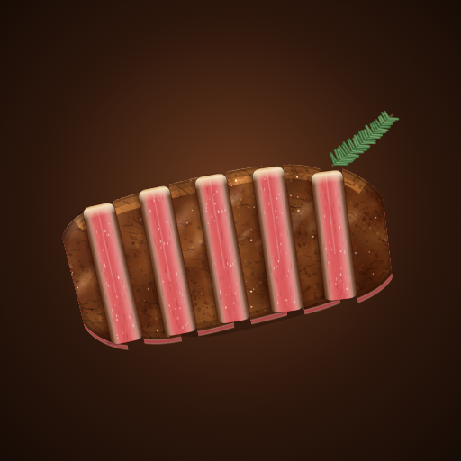

# 🥩 쿠킹 시뮬레이터

손질부터 플레이팅까지, **손으로 요리하는** 스테이크 모바일 게임 (Android / iOS).



**실시간 타이쿤 + 손맛 요리.** 손님이 오면 주문표가 쌓이고, 직접 조리하거나 직원에게 맡긴다. 요리는 실제 레시피 순서대로, 가니쉬는 준비대에서 손질한 만큼만.

| 구분 | 내용 |
|---|---|
| 앱 흐름 | 스플래시 → GAME START → 프롤로그 → 도움말 → 가게. 설정(사운드·진동·초기화), 일시정지, 안드로이드 뒤로가기 |
| 영업 | 11:00~21:00(실제 5분) 실시간. 손님 인내심, VIP, 자리 부족, 마감 정산 |
| 직원 | 견습·숙련·수셰프. 일반 주문 자동 조리(사장보다 품질 낮음), VIP는 사장만 |
| 메뉴 10종 | 채끝·안심·꽃등심·A5 와규 스테이크, 알리오 올리오, 까르보나라(로마식), 새우 토마토 파스타, 감바스 알 아히요, 랍스터 버터구이, 랍스터 테르미도르 |
| 조작 | 칼질=드래그 궤적, 소금·후추=흔들기, 뒤집기·유화=위로 휙, 소스 젓기=원 그리기, 면 건지기 타이밍 |
| 준비대 | 마늘·파슬리·토마토·바게트·레몬 등 11종 손질 → 인분 재고 |
| 성장 | 평판↑ → 단가↑(비싸면 만족도↓), 요리대회 입상 → 손님 몰림, 가게 4단계 확장 |

- 기획서: [docs/GDD.md](docs/GDD.md) · 아트 가이드: [docs/ART.md](docs/ART.md) · QA 보고서: [docs/QA.md](docs/QA.md)

## 구조
```
www/                 게임 본체 (빌드 도구 없는 순수 ES 모듈 + Canvas)
  js/sim.js          스테이크 열전달·마이야르 시뮬레이션
  js/geom.js         자유 곡선 다각형 분할(칼질) 등 기하
  js/motion.js       흔들기/휘젓기/플릭 감지 (+ 터치 대체 입력)
  js/meat.js, art.js, dish.js   절차적 그래픽
  js/score.js        평가
  js/scenes/*.js     타이틀·5단계·결과
android/, ios/       Capacitor 네이티브 프로젝트 (세로 고정, 전체화면)
tests/               단위 테스트 (node --test)
tools/               개발 서버, 자동 플레이 QA, 아이콘 생성
```

## 실행 / 테스트
```bash
npm install
npm run serve        # http://localhost:8080 (PC 브라우저에서는 마우스로 문지르기/쓸어올리기로 대체)
npm test             # 단위 테스트
npm run qa           # Chromium으로 게임 전체 자동 플레이 + 스크린샷(qa-output/)
```

## 앱 빌드
GitHub Actions(`.github/workflows/build.yml`)가 푸시마다 자동 빌드한다. Actions 탭의 실행 결과 → **Artifacts**에서 받는다.
- `cooking-simulator-android-apk` → `cooking-simulator-debug.apk` (휴대폰에 바로 설치 가능)
- `cooking-simulator-ios` → 시뮬레이터용 `.app`(zip), 서명 안 된 `.ipa`
  - 실기기 설치/배포에는 Apple 개발자 계정 서명이 필요하다. 로컬 Mac에서: `npm install && npx cap sync ios && npx cap open ios` → Xcode에서 Team 선택 후 실행.

로컬 빌드:
```bash
npx cap sync android && cd android && ./gradlew assembleDebug   # JDK 21 + Android SDK 필요
npx cap sync ios && npx cap open ios                            # macOS + Xcode 필요
```
